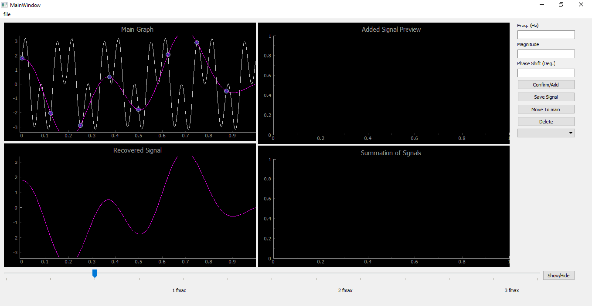

# Signal-Sampling-Illustrator
An illustrator for the analog signal recovery using the Nyquist rate theory.

|||
| ------------- | ------------- |
|  |  |
|  |  |
|  |  |

## Introduction:
Sampling an analog signal is a crucial step for any digital signal processing system. The Nyquist–Shannon 
sampling theorem guarantees a full recovery of the signal when sampling with a frequency larger than or equal to the 
bandwidth of the signal (or double the maximum frequency in case of real signals).
## Description:
Develop an illustrator for the signal recovery that shows the importance and validation of the Nyquist rate.
- Your application should allow the user to open a mid-length signal (around 1000 points length) and show it on 
the main graph.
- The user can sample the given/read signal and see the sampled points highlighted on top of the signal.
- The user can change the sampling rate via a slider that range from 0 Hz to 3fmax, where fmax is the maximum 
frequency in the read signal. When changing the sampling frequency, the sampled points are expected to be 
changed on the graph (ofcourse, the original signal will encounter no change when changing the sample rate).
- The app should be able to reconstruct/recover the signal from the sampled points. You need to do some search 
and readings to perform this step (we did not take the signal reconstruction yet in the lecture). You can refer to 
this wiki page for a quick and good resource. Note that reconstruction is done little different from what was 
explained in the lecture. We will revisit that in the coming lecture but be aware to how you do it!
- The user should be able to see the reconstructed signal from the sampled points in two ways:
o As a dotted signal on top of the original signal
o A new signal in a secondary graph below the main graph.
- The user can toggle the visibility of the secondary graph via some UI element (button or menu item) such that 
when it disappears, the main graph should take the whole space of the app window.
- The user should be able to maximize the app window normally. i.e., when maximized, all your control should 
resize/rescale to fill the window properly.
- You can find a good example for the final functionality of your app in this figure from the same previous wiki 
page.
- Your application should provide the user with a primitive signal composer where s/he can generate basic signals 
to test and validate on the app. Each signal is basically a summation of some sinusoidals and each sinusoidal has 
a specific frequency, magnitude and phase shift. The Signal Composer should show up either on the right side of 
the window where it can be resized via a splitter against the main illustrator graph OR as a separate tab in the 
application. The Composer should have the following functionalities:
o One graph to display the sinusoidal to be generated. A small panel should show beside the graph to 
control the frequency, magnitude and phase of the sinusoidal. Then, a button to confirm and add this 
sinusoidal to the summation.
o One graph to display the sum of the generated sinusoidals. There should be a combobox or menuitems 
through which the user can select one of the contributing sinusoidals and remove it via a delete button.
o When the user is settled on his/her synthetic signal (the one that shows up in the second graph), s/he 
confirm moving it to the main illustrator graph to start the sampling/recovery process.
- In your submission, you need to prepare at least 4 testing synthetic signals (generated and saved through your 
Composer) that address different testing scenarios. One example test case is the one mentioned in the lecture:
o A mix (i.e. summation) of 2Hz and 6Hz sinusoidals. If sampled with 12Hz or above, then it should be 
recovered nicely. But if sampled with 4Hz, then the two frequencies will show up as just one frequency. 
What if the signal is sampled with 8Hz?
You need to provide 3 more samples; each would exploit a problem or illustrate a tricky feature